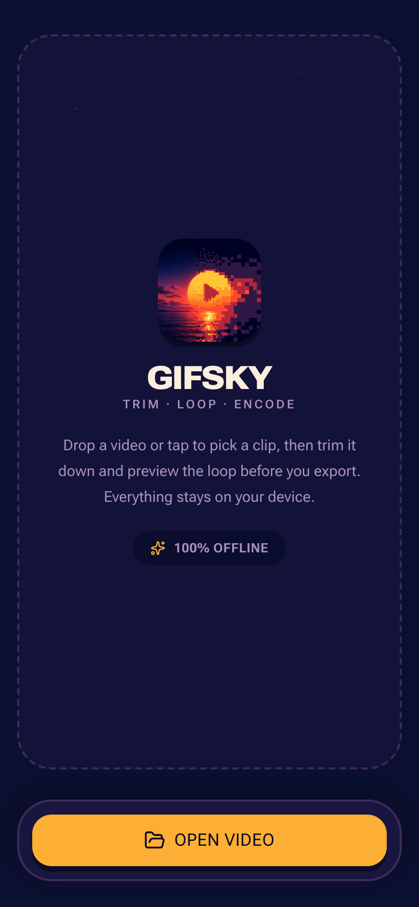
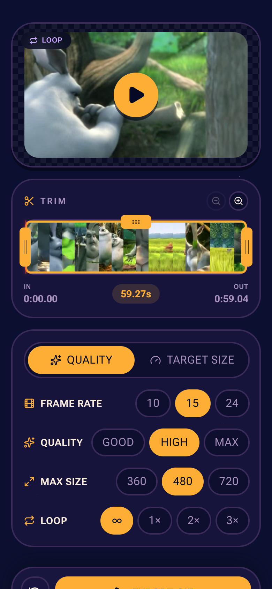

# Gifsky

Turn a video into a GIF, right in your browser. Drop in a
clip, trim it on a timeline, preview the loop, and export.
It's an installable PWA that works offline.

Nothing is ever uploaded: every frame is sampled and encoded **on your device**.

<p align="center">
  
  &nbsp;&nbsp;
  
</p>

## The name

Gifsky encodes with [**gifski**](https://gif.ski/), the high-quality GIF encoder.
Add a _sky_ and you get a web app living in the cloud — even though, ironically, all the
work happens locally and never leaves your device.

## Run

```sh
npm install
npm run dev
```

Then open http://localhost:5173/.

## License

Gifsky is licensed under the **GNU Affero General Public License v3.0 or later**
([AGPL-3.0-or-later](LICENSE)) required for compatibility with the bundled gifski
encoder, which is AGPL.

Copyright © 2026 Felix Gnass.
